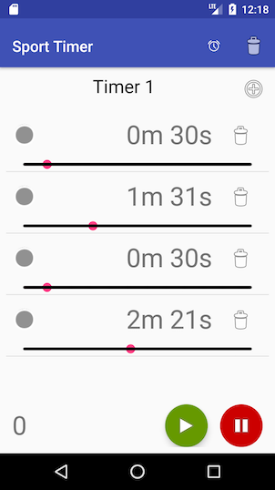

# SportTimerAndroid

SportTimer is an Android Application that allows to construct timers for a sport routines.
You can configure multiple timers and for each multiple durations for active vs. calm periods.
At the end of each duration a sound will play to indicate the change of duration.

SportTimer is available in English and French.

This application is open source under the MIT license.

## Download

The application isn´t accessible from the PlayStore. 
You can download it from the GitHub [Release page](https://github.com/jeancharles-roger/SportTimerAndroid/releases).

## Security concerns

Each release is constructed using [Travis-ci](https://travis-ci.org) and automatically deployed as a GitHub release without any human intervention. 
It ensures that no malicious code is added during the build process. 
Directly from the source to your phone :).

You can check the builds for each release [here](https://travis-ci.org/jeancharles-roger/SportTimerAndroid/branches) on Travis-ci.

## Icon

The icon are generated from AndroidAssetStudio:
- [Square](https://romannurik.github.io/AndroidAssetStudio/icons-launcher.html#foreground.type=clipart&foreground.clipart=access_alarm&foreground.space.trim=1&foreground.space.pad=0.4&foreColor=rgb(0%2C%200%2C%200)&backColor=rgb(63%2C%2081%2C%20181)&crop=0&backgroundShape=square&effects=shadow&name=ic_launcher).
- [Round](https://romannurik.github.io/AndroidAssetStudio/icons-launcher.html#foreground.type=clipart&foreground.clipart=access_alarm&foreground.space.trim=1&foreground.space.pad=0.4&foreColor=rgb(0%2C%200%2C%200)&backColor=rgb(63%2C%2081%2C%20181)&crop=0&backgroundShape=circle&effects=shadow&name=ic_launcher_round).

## Sounds

Sounds are downloaded from [SoundBible](http://soundbible.com)